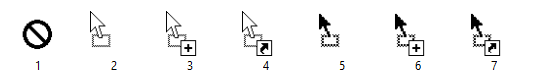

# Using Standard Drag/Drop Cursors in Other Events

Drag and drop cursors belong `ole32.dll` and they can be load them from that library. To do so, it's enough to load `ole32.dll` using `LoadLibrary`, then using `LoadCursor` get the handle of those cursors. Valid values for those cursors are 1 to 7:

In this example, I've created a `DragDropCursors` class, having following properties:

* None
* Move
* Copy
* Link
* MoveDark
* CopyDark
* LinkDark

You can simply use them by assigning them to `Cursor` property of a control:

    button1.Cursor = DragDropCursors.Copy;